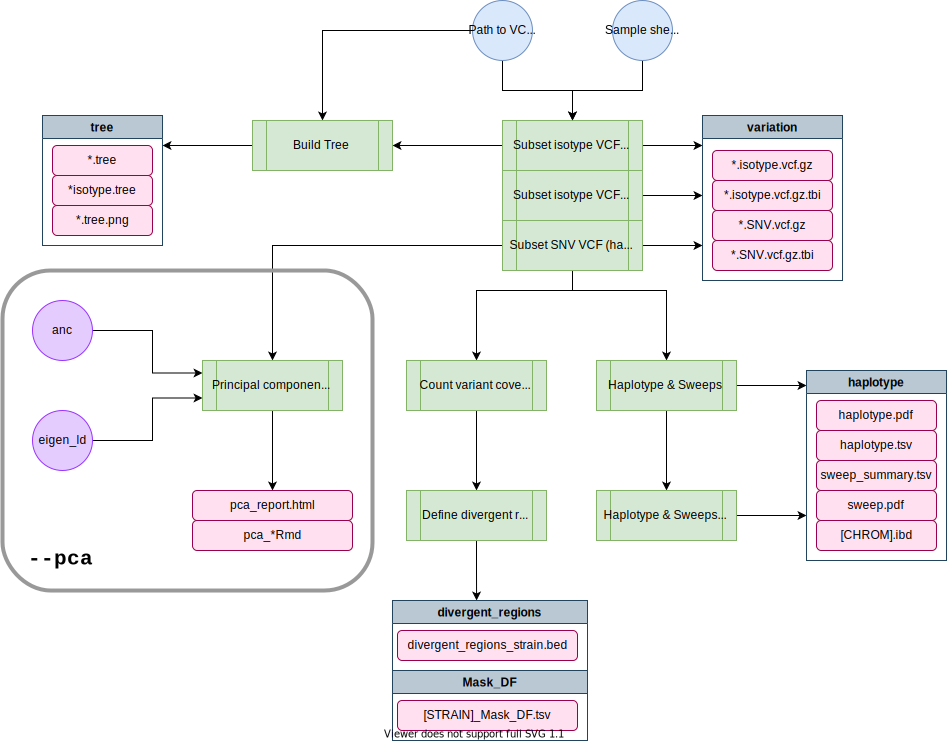

/badge.svg) /badge.svg) /badge.svg)


# post-gatk-nf

This pipeline performs population genetics analyses (such as identifying shared haplotypes and divergent regions) at the isotype level. The VCFs output from this pipeline are used within the lab and also released to the world via CaeNDR.

# Pipeline overview

```


      * * * *                    **           * * * *    * * *    * * * *    *   *                         *
     *       *                * * * * *     *        *  *     *      *       *  *                         * *
    *        *                   **         *           *     *      *       * *                         * *
   *        *   * * * * * *      **    ***  *           * * * *      *       * *      ***      *          *
  * * * * *    *   * *   * *     **         *    * * *  *     *      *       *  *             * * *      *
 *            *     *   *   *   *  *        *        *  *     *      *       *   *           *     *    *   *
*              * * *   * * * * *    *        * * * * *  *     *      *       *    *         *      * * * * *  
                                                                                                      **
                                                                                                     * * 
                                                                                                    *  *
                                                                                                   *  *
                                                                                                    *
                         
    parameters              description                                            Set/Default
    ==========              ===========                                            ========================
    --debug                 Use --debug to indicate debug mode                     (optional)
    --vcf_folder            Folder to hard and soft filtered vcf                   (required)
    --sample_sheet          TSV with column iso-ref strain, bam, bai (no header)   (required)
    --species               Species: 'c_elegans', 'c_tropicalis' or 'c_briggsae'   c_elegans
    --output                Output folder name.                                    popgen-date (in current folder)
    --postgatk              Run post-GATK steps                                    true
    --pca                   Run PCA analysis                                       false


```



## Software Requirements

* The latest update requires Nextflow version 23+. On Rockfish, you can access this version by loading the `nf23_env` conda environment prior to running the pipeline command:

```
module load python/anaconda
source activate /data/eande106/software/conda_envs/nf23_env
```

# Usage

*Note: if you are having issues running Nextflow or need reminders, check out the [Nextflow](http://andersenlab.org/dry-guide/latest/rockfish/rf-nextflow/) page.*

## Testing on Rockfish

*This command uses a test dataset*

```
nextflow run -latest andersenlab/post-gatk-nf --debug
```

## Running on Rockfish

You should run this in a screen or tmux session.

```
nextflow run -latest andersenlab/post-gatk-nf --vcf <path_to_vcf> --sample_sheet <path_to_sample_sheet>
```

# Parameters

## -profile

There are three configuration profiles for this pipeline.

* `rockfish` - Used for running on Rockfish (default).
* `quest`    - Used for running on Quest.
* `local`    - Used for local development.

>[!Note]
>If you forget to add a `-profile`, the `rockfish` profile will be chosen as default

## --debug

You should use `--debug` for testing/debugging purposes. This will run the debug test set (located in the `test_data` folder).

For example:

```
nextflow run -latest andersenlab/post-gatk-nf --debug
```

Using `--debug` will automatically set the sample sheet to `test_data/sample_sheet.tsv`

### Debugging for PCA:

You can debug the PCA pipeline with the following data/command:

```
nextflow run -latest andersenlab/post-gatk-nf --vcf ./test_data/WI.20220404.hard-filter.vcf.gz --species c_elegans --sample_sheet ./test_data/sample_sheet_2.tsv --eigen_ld 0.8,0.6 --anc XZ2019 --pca true -resume
```

## --sample_sheet

A custom sample sheet can be specified using `--sample_sheet`. The `sample sheet` is generated from the sample sheet used as input for [`wi-gatk-nf`](https://github.com/AndersenLab/wi-gatk) with only columns for strain, bam, and bai subsetted. **Make sure to remove any strains that you do not want to include in this analysis.** (*i.e. subset to keep only ISOTYPE strains*)

Remember that in `--debug` mode the pipeline will use the sample sheet located in `test_data/sample_sheet.tsv`.

*Important: There is no header for the sample sheet!*

The `sample sheet` has the following columns:

* __strain__ - the name of the strain
* __bam__ - name of the bam alignment file
* __bai__ - name of the bam alignment index file

*Note: As of 20210501, bam and bam.bai files for all strains of a particular species can be found in one singular location: `/projects/b1059/data/{species}/WI/alignments/` so there is no longer need to provide the location of the bam files.*

## --vcf_folder

Path to the **folder** containing both the hard-filtered and soft-filtered vcf outputs from [`wi-gatk`](https://github.com/AndersenLab/wi-gatk). VCF should contain **ALL** strains, the first step will be to subset isotype reference strains for further analysis.

*Note: This should be the **path to the folder**, we want to isotype-subset both hard and soft filtered VCFs. For example: `--vcf_folder /projects/b1059/projects/Katie/wi-gatk/WI-20210121/variation/` or `--vcf_folder /projects/b1059/data/c_elegans/WI/variation/20210121/vcf/`*

## --species (optional)

__default__ = c_elegans

Options: c_elegans, c_briggsae, or c_tropicalis

## PCA 
The PCA steps can be run either with the full pipeline or independently. To run only PCA use `-- pca true --postgatk false` 

The input VCF is filtered to bi-alleleic snps with no missing genotypes. A LD filtering threshold is required and LD filtering is performed using plink. You can also filter for singletons by specifying the `--singletons` 

PCA is performed using smartPCA. Parameters to control outlier threshold or removal iterations are desribed below.

## --postgatk (default: true)

Set to false to skip post-gatk steps

## --pca (default: false)

Set to true to run PCA analysis

## --snv_vcf (pca)

File path to SNV-filtered VCF

## --pops (pca)

Strain list to filter VCF for PCA analysis. No header:

| AB1 |
| --- |
| CB4856 |
| ECA788 |

>[!Note]
>If you run the standard profile with pca this file will be automatically generated to include all isotypes.

## --eigen_ld (pca)

LD thresholds to test for PCA. Can provide multiple with `--eigen_ld 0.8,0.6,0.4`

## --anc (pca)

Ancestor strain to use for PCA. 

>[!Note]
>Make sure this strain is in your VCF

## --output (optional)

__default__ - `popgen-YYYYMMDD`

A directory in which to output results. If you have set `--debug`, the default output directory will be `popgen-YYYYMMDD-debug`.

# Output

```
├── ANNOTATE_VCF
│   ├── ANC.bed.gz
│   ├── ANC.bed.gz.tbi
│   ├── Ce330_annotated.vcf.gz
|   └── Ce330_annotated.vcf.tbi
├── EIGESTRAT
│   └── LD_{eigen_ld}
│       ├── INPUT_FILES
│       │   └── *
│       ├── OUTLIER_REMOVAL
│       │   ├── eigenstrat_outliers_removed_relatedness
│       │   ├── eigenstrat_outliers_removed_relatedness.id
│       │   ├── eigenstrat_outliers_removed.evac
│       │   ├── eigenstrat_outliers_removed.eval
│       │   ├── logfile_outlier.txt
│       │   └── TracyWidom_statistics_outlier_removal.tsv
│       └── NO_REMOVAL
│           └── same as outlier_removal
├── pca_report.html
├── divergent_regions
│   ├── Mask_DF
│   │   └── [strain]_Mask_DF.tsv
|   └── divergent_regions_strain.bed
├── haplotype
│   ├── haplotype_length.pdf
│   ├── sweep_summary.tsv
│   ├── max_haplotype_genome_wide.pdf
│   ├── haplotype.pdf
│   ├── haplotype.tsv
│   ├── [chr].ibd
│   └── haplotype_plot_df.Rda
├── tree
│   ├── WI.{date}.hard-filter.isotype.min4.tree
│   ├── WI.{date}.hard-filter.isotype.min4.tree.pdf
│   ├── WI.{date}.hard-filter.min4.tree
│   └── WI.{date}.hard-filter.min4.tree.pdf
├── NemaScan
│   ├── strain_isotype_lookup.tsv
│   ├── div_isotype_list.txt
│   ├── haplotype_df_isotype.bed
│   ├── divergent_bins.bed
│   └── divergent_df_isotype.bed
└── variation
    ├── WI.{date}.small.hard-filter.isotype.vcf.gz
    ├── WI.{date}.small.hard-filter.isotype.vcf.gz.tbi
    ├── WI.{date}.hard-filter.isotype.SNV.vcf.gz
    ├── WI.{date}.hard-filter.isotype.SNV.vcf.gz.tbi
    ├── WI.{date}.soft-filter.isotype.vcf.gz
    ├── WI.{date}.soft-filter.isotype.vcf.gz.tbi
    ├── WI.{date}.hard-filter.isotype.vcf.gz
    └── WI.{date}.hard-filter.isotype.vcf.gz.tbi

```

# Relevant Docker Images

* `andersenlab/postgatk` ([link](https://hub.docker.com/r/andersenlab/postgatk)): Docker image is created within this pipeline using GitHub actions. Whenever a change is made to `env/postgatk.Dockerfile` or `.github/workflows/build_postgatk_docker.yml` GitHub actions will create a new docker image and push if successful
* `andersenlab/tree` ([link](https://hub.docker.com/r/andersenlab/tree)): Docker image is created within this pipeline using GitHub actions. Whenever a change is made to `env/tree.Dockerfile` or `.github/workflows/build_tree_docker.yml` GitHub actions will create a new docker image and push if successful
* `andersenlab/pca` ([link](https://hub.docker.com/r/andersenlab/pca)): Docker image is created within this pipeline using GitHub actions. Whenever a change is made to `env/pca.Dockerfile` or `.github/workflows/build_pca_docker.yml` GitHub actions will create a new docker image and push if successful
* `andersenlab/r_packages` ([link](https://hub.docker.com/r/andersenlab/r_packages)): Docker image is created manually, code can be found in the [dockerfile](https://github.com/AndersenLab/dockerfile/tree/master/r_packages) repo.


Make sure that you add the following code to your `~/.bash_profile`. This line makes sure that any singularity images you download will go to a shared location on `/vast/eande106` for other users to take advantage of (without them also having to download the same image).

```
# add singularity cache
export SINGULARITY_CACHEDIR='/vast/eande106/singularity/'
```
